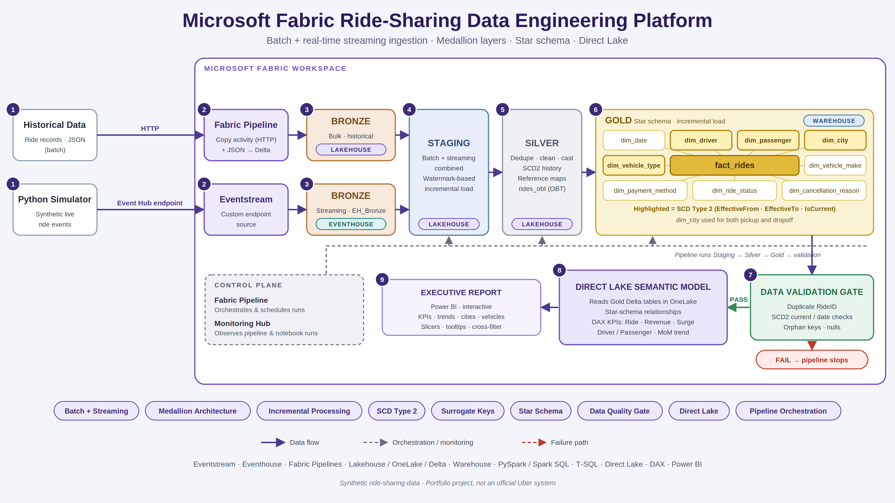
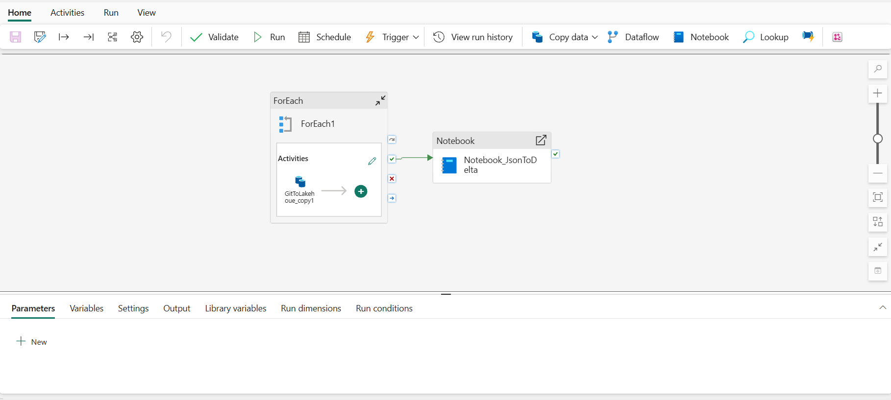
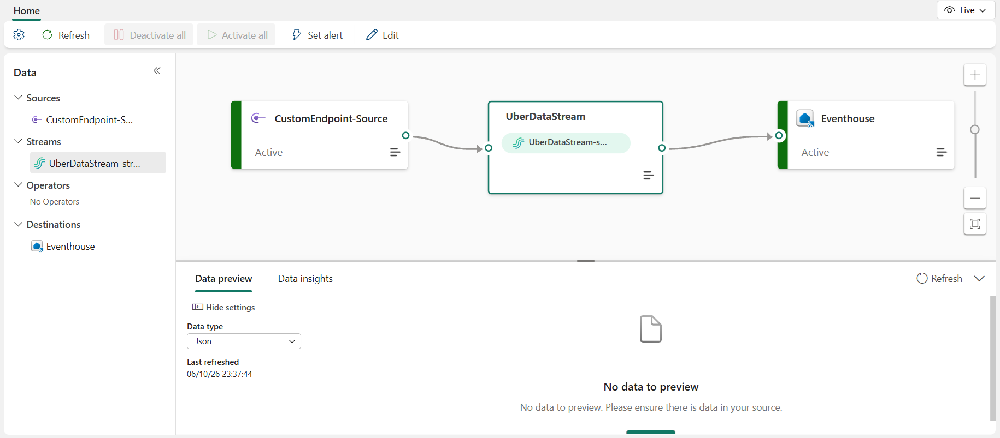
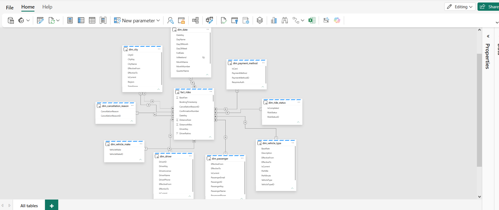
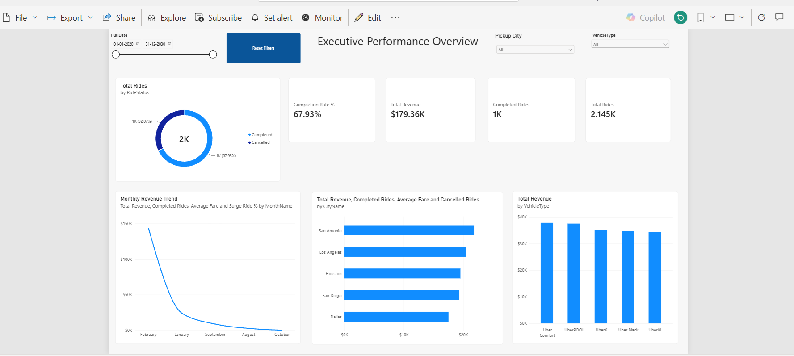

# Microsoft Fabric Ride-Sharing Data Platform

End-to-end data engineering project on **Microsoft Fabric**. Historical (batch) and real-time streaming ride data are ingested, combined, cleaned, modeled into a star schema with SCD Type 2 history, validated, and served through a Direct Lake semantic model to a Power BI report.

> The data is **synthetic** and ride-sharing themed. This is a portfolio project, not an official Uber system.



**Stack:** Eventstream · Eventhouse (KQL) · Fabric Data Factory pipelines · Lakehouse (OneLake / Delta) · Fabric Warehouse · PySpark · Spark SQL · T-SQL stored procedures · Direct Lake · DAX · Power BI

---

## Build Log (chronological)

### Step 1: Environment setup
- Created a Fabric workspace and the **`Uber_Lakehouse`** Lakehouse with three schemas: `LH_Bronze`, `LH_Staging`, `LH_Silver`.
- Created an **Eventhouse** (KQL database `Stream_Database`) as the streaming landing zone.
- Created a **Fabric Warehouse** for the Gold layer.

### Step 2: Batch ingestion (historical JSON → Bronze)
Pipeline: `ForEach` → Copy activity (`GitToLakehouse_copy1`) → Notebook `Notebook_JsonToDelta`.



1. The Copy activity loops over the file list and pulls each JSON file over **HTTP** into `Files/Raw_Data` in the Lakehouse.
2. `Notebook_JsonToDelta` lists the folder, reads each file (`multiLine` JSON) and writes it as a Delta table with `mode("overwrite")`.
3. Tables created in `LH_Bronze`:

| Table | Content |
|---|---|
| `bulk_rides` | Historical ride records |
| `map_cities`, `map_vehicle_types`, `map_vehicle_makes` | Reference data |
| `map_payment_methods`, `map_ride_statuses`, `map_cancellation_reasons` | Reference data |

### Step 3: Streaming ingestion (simulator → Eventhouse)
- A **Python simulator** generates ride events (JSON) and sends them to the Eventstream through its **custom endpoint source** (Event Hub connection).
- Eventstream `UberDataStream` routes events to the Eventhouse destination.
- Landing table: **`EH_Bronze`** in `Stream_Database`.



### Step 4: Staging layer (batch + streaming combined)
**`01_Staging_Setup`** (run once, re-runnable)
- Creates `LH_Staging.staging_rides`, bootstrapped with `CREATE TABLE AS SELECT` from `LH_Bronze.bulk_rides` plus two audit columns: `bronze_ingestion_timestamp`, `staging_load_timestamp`.
- Creates the control table `LH_Staging.load_control (source_name, last_processed_timestamp)` and seeds a watermark row for `EH_Bronze` with `MERGE` so an existing watermark is never overwritten.

**`01_Staging_Daily`** (incremental)
1. Reads `EH_Bronze` from the Eventhouse with the **Kusto Spark connector**, adding `ingestion_time()` as `bronze_ingestion_timestamp`.
2. Loads the stored watermark and keeps only rows newer than it.
3. Removes rides already in staging with a **left-anti join on `ride_id`**.
4. Casts columns to the target schema, checks for missing columns, and appends to `staging_rides`.
5. Advances the watermark (Delta `MERGE`) **only after** the append succeeds, using the max ingestion time of the processed batch.
6. Prints a load summary (records after watermark, rides appended, total staging rows, current watermark).

Example run: 126 records in the Eventhouse, 0 new after the watermark, 2,126 total staging rows.

### Step 5: Silver layer (clean, history, enrich)
**`02_Silver_Setup`** creates `LH_Silver` and the target tables: four SCD2 tables (`driver_scd`, `passenger_scd`, `city_scd`, `vehicle_type_scd`), four Type 1 maps, and `rides_obt`.

**`02_Silver_Daily`** (Spark SQL, rerun-safe, never drops the schema)

| Stage | Implementation |
|---|---|
| Prerequisite check | Raises an error if any required Silver table is missing |
| Dedupe | `vw_silver_rides_ranked`: `ROW_NUMBER()` per `ride_id`, newest staging load wins; blank IDs excluded |
| Clean | `vw_silver_rides_clean`: `TRIM` on strings, `TRY_CAST` on timestamps |
| Driver / passenger SCD2 | `*_latest` view → `*_changes` view (null-safe `<=>` compare, flags `NEW` / `CHANGED`) → `MERGE` expires the old row (`effective_to`, `is_current = false`) → `INSERT` the new version with key `MAX(key) + ROW_NUMBER()` |
| City / vehicle type SCD2 | Same pattern, sourced from `LH_Bronze.map_cities` and `map_vehicle_types`; change time is `CURRENT_TIMESTAMP()` |
| Type 1 maps | `MERGE` upserts for vehicle makes, payment methods, ride statuses, cancellation reasons |
| `vw_rides_obt` | Joins each ride to the passenger and driver version valid at ride time (effective-date range), current city and vehicle-type versions, and all maps |
| Load | `MERGE` into `rides_obt` on `ride_id` |
| Checks | One current row per business key; no duplicate `ride_id` in `rides_obt` |

Driver rating is deliberately not tracked in the driver SCD because it varies per ride.

### Step 6: Gold layer (Warehouse, star schema)
**`03_Gold_Setup`** (T-SQL, run once or when procedures change)
- Creates 9 dimension tables and `fact_rides` with `IF OBJECT_ID(...) IS NULL` guards.
- Creates one load procedure per dimension and `usp_load_fact_rides`. All read cross-database from `[Uber_Lakehouse].[LH_Silver]`.

**`03_Gold_Daily`** (run by the pipeline)
1. Fails fast if Gold setup is missing.
2. Executes the dimension procedures first, then the fact procedure:

```sql
EXEC dbo.usp_load_dim_date;
EXEC dbo.usp_load_dim_passenger;      -- SCD2 sync
EXEC dbo.usp_load_dim_driver;         -- SCD2 sync
EXEC dbo.usp_load_dim_city;           -- SCD2 sync
EXEC dbo.usp_load_dim_vehicle_type;   -- SCD2 sync
EXEC dbo.usp_load_dim_vehicle_make;
EXEC dbo.usp_load_dim_payment_method;
EXEC dbo.usp_load_dim_ride_status;
EXEC dbo.usp_load_dim_cancellation_reason;
EXEC dbo.usp_load_fact_rides;
```

3. Runs four inline gates that `THROW` on failure: duplicate `RideID`, multiple current driver versions, multiple current passenger versions, invalid `DateKey`.

Implementation notes:
- **SCD dimensions:** update existing versions by surrogate key where any attribute or effective date differs, then insert versions not yet present.
- **`dim_date`:** generated from the min/max `booking_timestamp` in `rides_obt`, with `DateKey = YYYYMMDD`.
- **`fact_rides`:** updates rides whose values changed, then inserts new rides; `DateKey` is derived from `booking_timestamp`.
- **`dim_city`:** the fact carries both `PickupCityKey` and `DropoffCityKey`.

### Step 7: Data validation notebook
**`04_Daily_Data_Validation`** (T-SQL against the Warehouse) collects failures from 14 checks and throws error `51000` if any fail, which fails the pipeline.

| Group | Checks |
|---|---|
| Grain | Duplicate `RideID` in `fact_rides` |
| SCD2 current rows | At most one `IsCurrent = 1` per passenger, driver, city |
| SCD2 dates | Current rows have `EffectiveTo` NULL; expired rows have `EffectiveTo > EffectiveFrom` (3 dimensions) |
| Referential integrity | `DateKey`, `PassengerKey`, `DriverKey`, `PickupCityKey`, `DropoffCityKey`, `VehicleTypeKey` exist in their dimensions |
| Required values | Core keys and `BookingTimestamp` are not NULL |

On success it returns `PASS` with fact row count, unique ride IDs and latest booking timestamp.

### Step 8: Orchestration
One Fabric pipeline chains four notebook activities, each running only on the previous one's success:

`Staging_Layer` → `Silver_Layer` → `Gold_Layer` → `Data_validation`


### Step 9: Semantic model (Direct Lake)
- Built a **Direct Lake** semantic model on the Gold tables, with relationships from `fact_rides` to all nine dimensions.
- `dim_city` has two relationships to the fact (pickup, dropoff); **pickup** is the active one used by the report.
- Wrote DAX measures, grouped in display folders:

| Group | Measures |
|---|---|
| Ride | Total / Completed / Cancelled Rides, Completion Rate %, Cancellation Rate % |
| Revenue | Total Revenue, Average Fare, Total Tips |
| Surge | Surge Rides, Surge Ride %, Average Surge Multiplier, Surge Revenue, Surge Revenue %, Average Surge Fare, Non-Surge Rides / Revenue / Average Fare, Surge Fare Premium % |
| Trip | Average Distance, Average Duration |
| Passenger / Driver | Unique Passengers, Rides per Passenger, Active Drivers, Rides per Driver, Average Driver Rating |
| Trend | Previous Month Rides / Revenue, Ride Growth % MoM, Revenue Growth % MoM |
| Quality | Average Ride Rating |



### Step 10: Executive report
Single-page **Executive Performance Overview**:
- **Filters:** date range, pickup city, vehicle type, bookmark-based **Reset Filters** button
- **KPI cards:** Total Rides, Completed Rides, Completion Rate %, Total Revenue
- **Visuals:** ride status donut, monthly revenue trend, revenue and rides by pickup city, revenue by vehicle type
- **Interactions:** cross-filtering, cross-highlighting, tooltips



### Step 11: End-to-end testing and troubleshooting
**Incremental test:** generated new rides, ran the pipeline, and traced them through each layer:
1. New events arrive in `EH_Bronze`
2. Staging row count increases and the watermark advances
3. `rides_obt` picks up the new rides
4. `fact_rides` row count increases in Gold
5. Validation passes
6. Row count confirmed in the semantic model with a DAX diagnostic, then in the report:

```dax
EVALUATE ROW("Fact Rides Row Count", COUNTROWS(fact_rides))
```

**Issue 1: NULL cancellation reason**
- *Symptom:* the Gold `dim_cancellation_reason` load failed.
- *Trace:* `CancellationReason` is `NOT NULL` in Gold → Silver map had a NULL for ID 4 → the NULL was already in the Bronze reference file.
- *Fix:* Bronze and Silver stay source-faithful; the Gold layer maps the NULL to **`Not Applicable`**.

**Issue 2: Spark capacity error**
- *Symptom:* `TooManyRequestsForCapacity` (HTTP 430), Livy session could not be created.
- *Cause:* concurrent Spark compute limit reached, not a logic error.
- *Resolution:* found the running jobs in **Monitoring Hub**, stopped unneeded Spark sessions, and re-ran.

---

## Repository Structure

```
├── README.md
├── docs/images/          # architecture diagram, screenshots
├── notebooks/
│   ├── Notebook_JsonToDelta.ipynb
│   ├── 01_Staging_Setup.ipynb
│   ├── 01_Staging_Daily.ipynb
│   ├── 02_Silver_Setup.ipynb
│   ├── 02_Silver_Daily.ipynb
│   ├── 03_Gold_Setup.ipynb
│   ├── 03_Gold_Daily.ipynb
│   └── 04_Daily_Data_Validation.ipynb
└── simulator/            # Python event generator
```

## Run Order
1. Run the batch pipeline (Step 2) to populate `LH_Bronze`.
2. Start the simulator so events reach the Eventstream and `EH_Bronze`.
3. Run once: `01_Staging_Setup` → `02_Silver_Setup` → `03_Gold_Setup`.
4. Run the daily pipeline: `Staging_Layer` → `Silver_Layer` → `Gold_Layer` → `Data_validation`.
5. Open the semantic model and report.

## Skills Demonstrated
Batch + streaming ingestion · Eventstream / Eventhouse · watermark-based incremental loading · medallion layering · SCD Type 2 · surrogate keys · T-SQL stored procedures · pipeline orchestration · data-quality gates · Direct Lake · DAX · root-cause troubleshooting
